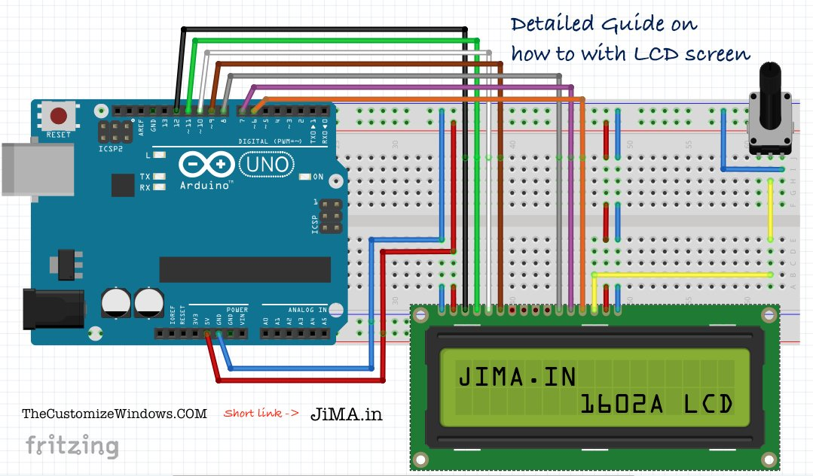

# 1602A Display LCD
### Introdução
Esse display exibe informações em uma tela de 16x2 caracteres, em que um caractere possui uma resolução 5x10 pixels.
### Montagem
Este display é capaz de trabalhar de 2 formas possíveis: Com 4 bits de informação ou 8 bits de informação. Cada bit vai requere uma porta digital no Arduino, você poderá utilizar 4 bits e assim economizar 4 portas digitais, o uso de 8 portas com 8 bits de informação é indicado para aplicações em que precise-se de uma atualização em tempo real realmente rápida no display.

|Pino|Função|
|-|-|
|GND|GND|
|VDD|VCC|
|VO|[Contraste do display](#Contraste-do-display)|
|RS|Controle, se está sendo enviado texto ou tratamentos para a string já exibida, ou mesmo nova string|
|RW|[Controle, ler ou escrever informações que já estão no display](#Controle-ler-e-escrever)|
|E|Enable, Arduino informa que está enviando informações ao display|
|D0|Pino de dado(usar somente em modo 8bits)|
|D1|Pino de dado(usar somente em modo 8bits)|
|D2|Pino de dado(usar somente em modo 8bits)|
|D3|Pino de dado(usar somente em modo 8bits)|
|D4|Pino de dado|
|D5|Pino de dado|
|D6|Pino de dado|
|D7|Pino de dado|
|BLA|Luz de fundo do display VCC|
|BLK|[Luz de fundo do display GND](#Luz-de-fundo-do-display-GND)|
#####  Contraste do display
> 1 - É possível colocar um potenciômetro para regular a intensidade do contraste. 
> 2 - Caso desnecessário, conecte o pino VO ao GND para obter o contraste máximo.
##### Controle ler e escrever
> 1 - Caso seja nescessário
##### Luz de fundo do display, GND
> Para porta VCC 5V do Arduino, use um resistor de 220Ω se não led **Irá queimar!**
> Pode-se usar o resistor tanto no VCC quanto no GND.

### Consumo de corrente e voltagem
Ele trabalha com uma voltagem na faixa de 3-5.5V, consumindo uma corrente de no máximo 2.5mAh.
### Consumo de memória flash e SRAM no Arduino Uno
O Scketch padrão para teste do sensor fornecido pela bibliteca [<DHT.h>](https://www.arduino.cc/reference/en/libraries/dht-sensor-library/) consome 6728 bytes da memória flash, equivalente a 20% da capacidade total. Variáveis no Scketch consomem 219 bytes de memória SRAM, equivalente a 10% da capacidade total.
### Bibliotecas utilizadas
Para funcionamento do sensor, será necessária instalação da biblioteca [<DHT.h>](https://www.arduino.cc/reference/en/libraries/dht-sensor-library/) na Arduino IDE. O Scketch a seguir é um exemplo de como utilizá-la, este que é fornecido pela própria biblioteca na seção de exemplos:
```

```
