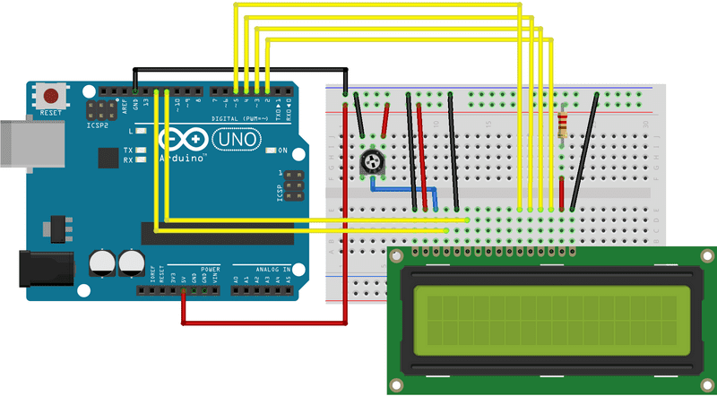

# 1602A Display LCD
### Introdução
Esse display exibe informações em uma tela de 16x2 caracteres, em que um caractere possui uma resolução 5x10 pixels.
### Montagem
Este display é capaz de trabalhar de 2 formas possíveis: Com 4 bits de informação ou 8 bits de informação. Cada bit vai requere uma porta digital no Arduino, você poderá utilizar 4 bits e assim economizar 4 portas digitais, o uso de 8 portas com 8 bits de informação é indicado para aplicações em que precise-se de uma atualização em tempo real realmente rápida no display.

|Pino|Função|
|-|-|
|GND|GND|
|VDD|VCC|
|VO|[Contraste do display](#Contraste-do-display)|
|RS|Controle, se está sendo enviado texto ou tratamentos para a string já exibida, ou mesmo nova string|
|RW|[Controle, ler ou escrever informações que já estão no display](#Controle-ler-e-escrever)|
|E|Enable, Arduino informa que está enviando informações ao display|
|D0|Pino de dado(usar somente em modo 8bits)|
|D1|Pino de dado(usar somente em modo 8bits)|
|D2|Pino de dado(usar somente em modo 8bits)|
|D3|Pino de dado(usar somente em modo 8bits)|
|D4|Pino de dado|
|D5|Pino de dado|
|D6|Pino de dado|
|D7|Pino de dado|
|BLA|Luz de fundo do display VCC|
|BLK|[Luz de fundo do display GND](#Luz-de-fundo-do-display-GND)|
#####  Contraste do display
> * É possível colocar um potenciômetro para regular a intensidade do contraste. 
> * Caso desnecessário, conecte o pino VO ao GND para obter o contraste máximo.
##### Controle ler e escrever
> Caso seja desnecessária a leitura de dados do display, o pino RW pode ser removido.
##### Luz de fundo do display GND
> Para porta VCC 5V do Arduino, use um resistor de 220Ω se não led **Irá queimar!**
> Pode-se usar o resistor tanto no VCC quanto no GND.

### Consumo de corrente e voltagem
Ele trabalha com uma voltagem na faixa de 4.5-5.5V, consumindo uma corrente de no máximo 1.2mA.
### Consumo de memória flash e SRAM no Arduino Uno
O código de teste usado, utilizando a mínima quantidade de pinos possível (rs, e, d4, d5, d6, d7), além de obviamente os pinos que alimentam o LCD e o LED do LCD (GND, VDD, BLA, BLK) consumiu 1866 bytes da memória flash, que equivale a 5% da capacidade total, e consumiu 65 bytes de SRAM equivalendo a 3% da capacidade total.
### Bibliotecas utilizadas
Para funcionamento display, será necessária instalação da biblioteca [<LiquidCrystal.h>](https://www.arduino.cc/reference/en/libraries/liquidcrystal/) na Arduino IDE. O Scketch a seguir é um exemplo de como utilizá-la:
```
#include <LiquidCrystal.h>

//                rs   e    d4  d5  d6  d7
LiquidCrystal lcd(12,  11,  5,  4,  3,  2);

void setup() {
  lcd.begin(16,2);
  lcd.clear();
  lcd.print("Hello world!!!");
  lcd.setCursor(0, 1); // coluna linha
  lcd.print("UFFS");
}

void loop() {
  delay(99999999);
}
```
> Busque por "[1602A datasheet](https://www.google.com/search?q=1602A+datasheet)" ou "[1602A LCD datasheet](https://www.google.com/search?q=1602A+LCD+datasheet)" para mais informações sobre este componente.
