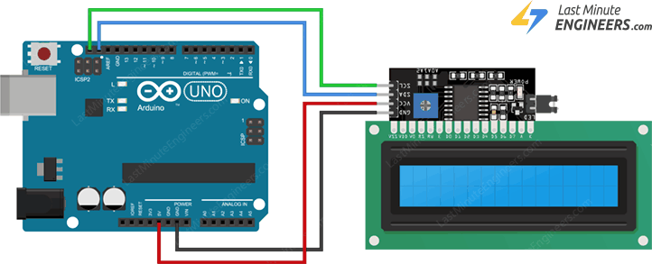
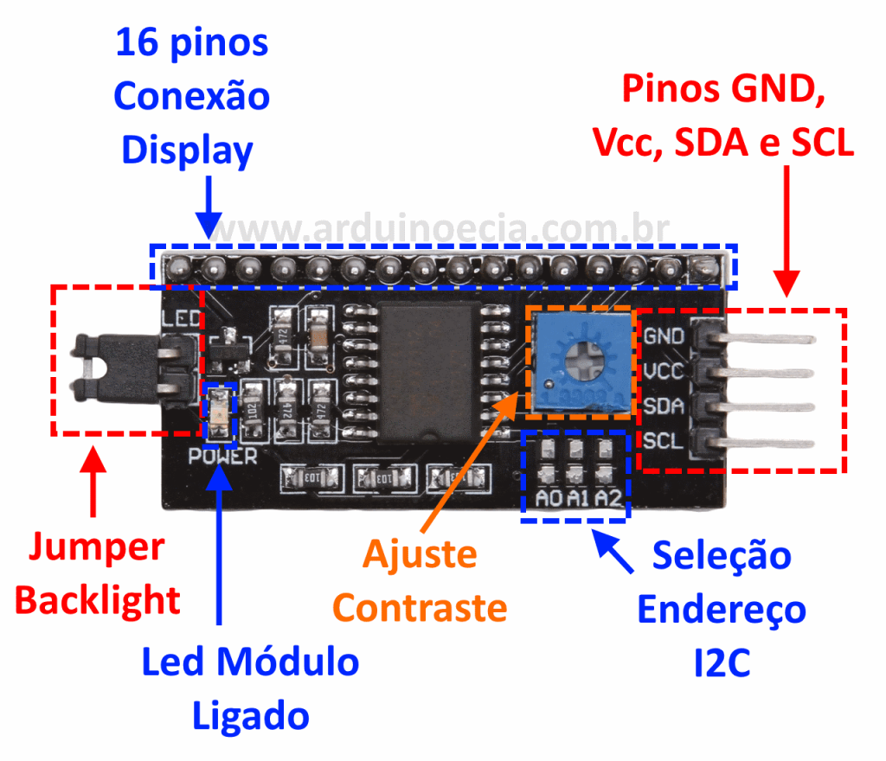

# 1602A Display LCD + Módulo I2C
### Introdução
Esse display exibe informações em uma tela de 16x2 caracteres, em que um caractere possui uma resolução 5x10 pixels. Módulo I2C reduz a quantidade de interface usada para dados com apenas 2 pinos.
### Montagem
Trabalha conectado ao
 
|Pino|Função|
|-|-|
|GND|GND|
|VCC|VCC|
|SDA|SDA(dados) do Arduino|
|SCL|SCL(clock) do Arduino|

### Consumo de corrente e voltagem
O conjunto trabalha com uma voltagem na faixa de 4.5-5.5V, consumindo uma corrente de no máximo 50mA.
### Consumo de memória flash e SRAM no Arduino Uno
O sketch exemplo da biblioteca "HelloWorld" usa 3382 bytes (10%) de espaço de armazenamento para programas. O máximo são 32256 bytes.
Variáveis globais usam 327 bytes (15%) de memória dinâmica, deixando 1721 bytes para variáveis locais. O máximo são 2048 bytes.
### Bibliotecas utilizadas
Para funcionamento display, será necessária instalação da biblioteca [<LiquidCrystal_I2C.h>](https://www.arduino.cc/reference/en/libraries/liquidcrystal-i2c/) na Arduino IDE. O Scketch a seguir é um exemplo de como utilizá-la:
```
//YWROBOT
//Compatible with the Arduino IDE 1.0
//Library version:1.1
//#include <Wire.h> 
#include <LiquidCrystal_I2C.h>

LiquidCrystal_I2C lcd(0x27,20,4);  // set the LCD address to 0x27 for a 16 chars and 2 line display

void setup()
{
  lcd.init();                      // initialize the lcd 
  lcd.init();
  // Print a message to the LCD.
  lcd.backlight();
  lcd.setCursor(3,0);
  lcd.print("Hello, world!");
  lcd.setCursor(2,1);
  lcd.print("Ywrobot Arduino!");
   lcd.setCursor(0,2);
  lcd.print("Arduino LCM IIC 2004");
   lcd.setCursor(2,3);
  lcd.print("Power By Ec-yuan!");
}


void loop()
{
}
```
