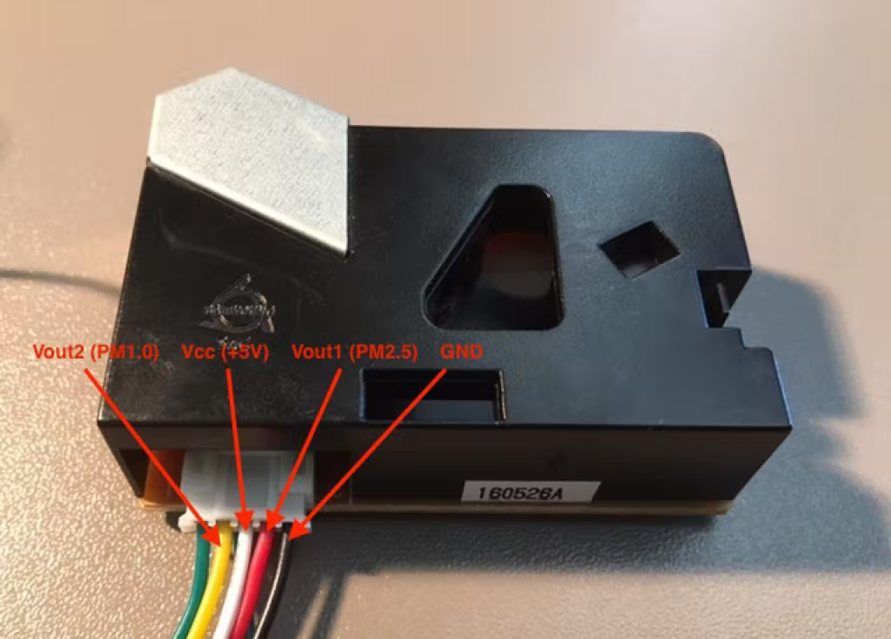

# DSM501A PM2.5 e PM10 sensor ótico de partículas
### Introdução
Este sensor é capaz de ler a quantidade partículas no ar indicando o nível de poluição e a qualidade do ar, medindo partículas (*Particulate matter* ou Material particulado) de tamanho 2.5μm e 10μm.
### Montagem
Leia o [artigo](https://create.arduino.cc/projecthub/mircemk/arduino-air-quality-monitor-with-dsm501a-sensor-b4f8fc) para um compreensão mais detalhada caso sinta necessidade. 

Da esquerda para a direita, em pé olhando pelo lado de trás(as cores dos fios podem mudar, esqueça-as):
|Pino|Função|
|-|-|
|Fio 0|Controle (controle de sensibilidade para Vout1)|
|Fio 1|Vout2 (PM10)|
|Fio 2|VCC|
|Fio 3|Vout1 (PM2.5)|
|Fio 4|GND|

Vout1 conectado ao pino D3, Vout2 conectado ao pino D4.
### Consumo de corrente e voltagem
Ele trabalha com uma voltagem de 5V, consumindo uma corrente de no máximo 90mA.
### Consumo de memória flash e SRAM no Arduino Uno
O Scketch utilizado no teste consumiu 5682 de memória flash equivalendo a 17% da capacidade total e 312 de SRAM equivalendo a 15% da capacidade total.
### Bibliotecas utilizadas
Até o momento, não foi encontrada uma biblioteca para gerenciar este sensor, então os cálculos de conversão são feitos diretamente em código:
```
int pin2 = 4; // D3
int pin1 = 3; // D2
unsigned long duration1;
unsigned long duration2;

unsigned long starttime;
unsigned long sampletime_ms = 3000;//sampe 1s ;
unsigned long lowpulseoccupancy1 = 0;
unsigned long lowpulseoccupancy2 = 0;
float ratio1 = 0;
float ratio2 = 0;
float concentration1 = 0;
float concentration2 = 0;

void setup() {
  Serial.begin(9600);
  pinMode(2,INPUT);
  pinMode(3,INPUT);
  starttime = millis();//get the current time;
}

void loop() {
  duration1 = pulseIn(pin1, LOW);
  duration2 = pulseIn(pin2, LOW);
  lowpulseoccupancy1 = lowpulseoccupancy1+duration1;
  lowpulseoccupancy2 = lowpulseoccupancy2+duration2;


  if ((millis()-starttime) > sampletime_ms)//if the sampel time == 30s
  {
    ratio1 = lowpulseoccupancy1/(sampletime_ms*10.0);  // Integer percentage 0=>100
    concentration1 = 1.1*pow(ratio1,3)-3.8*pow(ratio1,2)+520*ratio1+0.62; // using spec sheet curve

    ratio2 = lowpulseoccupancy2/(sampletime_ms*10.0);  // Integer percentage 0=>100
    concentration2 = 1.1*pow(ratio2,3)-3.8*pow(ratio2,2)+520*ratio2+0.62; // 
       
    Serial.print("concentration1 = ");
    Serial.print(concentration1);
    Serial.print(" pcs/0.01cf  -  ");

    Serial.print("concentration2 = ");
    Serial.print(concentration2);
    Serial.print(" pcs/0.01cf  -  ");
    
    if (concentration1 < 1000) {
     Serial.print("Clean");
     Serial.print(concentration1);
    }
    
    if (concentration1 > 1000 && concentration1 < 10000) {
     Serial.print("GOOD");
     Serial.print(concentration1);
    }
    
    if (concentration1 > 10000 && concentration1 < 20000) {      
     Serial.print("ACCEPTABLE");
     Serial.print(concentration1);
    }
      if (concentration1 > 20000 && concentration1 < 50000) {
     Serial.print("HEAVY");
     Serial.print(concentration1);
  }

    if (concentration1 > 50000 ) {   
     Serial.print("HAZARD");
     Serial.print(concentration1);        
    } 

    Serial.println();
      
    lowpulseoccupancy1 = 0;
    lowpulseoccupancy2 = 0;
    starttime = millis();
  }
}
```
> Busque por "[DSM501A datasheet](https://www.google.com/search?q=DSM501A+datasheet)" para mais informações sobre este componente.
