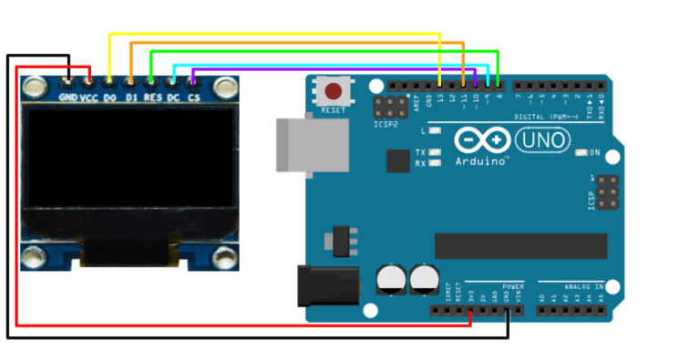

# HW-236 Oled no padrão de dados SPI/IIC
### Introdução
Este display Oled de 0.96 polegadas é capaz de exibir informações (textos, imagens, gráficos, etc) em uma resolução de 128x64 pixels, sendo que a faixa superior é  da cor amarela, e o resto do display é na cor azul.
### Montagem
Há diferentes versões do display oled, mudando a ordem e quantidade dos pinos(isso está ligado com o padrão de comunicação I2C ou SPI), resolução da tela e cor dos pixels(existem versões RGB com 16 milhões de cores). 

|Pino|Função|
|-|-|
|GND|GND|
|VCC|VCC|
|D0 (SCK, SCL, CLK)|Relógio(clock) é fornecido através deste pino|
|D1 (SDA, MOSI)|Este é o pino de dados|
|RES (RST,RESET)|Reset|
|DC (A0)|Pino de comando|
|CS|Seleção de chip, Normalmente mantido baixo, usado apenas quando mais de um dispositivo SPI está conectado ao MCU|
### Consumo de corrente e voltagem
Ele trabalha com uma voltagem na faixa de 3.3-5V, consumindo uma corrente de no máximo _undefined_.
### Consumo de memória flash e SRAM no Arduino Uno
O Scketch utilizado para teste consumiu 8592 bytes de memória flash que equivale a 26% da capacidade total e consumiu 298 bytes da SRAM equivalendo a 14% da capacidade total.
### Bibliotecas utilizadas
Para funcionamento do sensor, será necessária instalação da biblioteca [<U8glib.h>](https://www.arduino.cc/reference/en/libraries/u8glib/) na Arduino IDE. O Scketch a seguir é um exemplo de como utilizá-la:
```
#include <U8glib.h>

U8GLIB_SH1106_128X64 oled(13, 11, 8, 9, 10);  // D0, D1, CS, DC, Reset 
unsigned long tempo = 0;
int cont = 0;

void setup() {
  oled.setFont(u8g_font_helvR12);
}

void loop() {
  int temperatura = 30;
  int umidade = 70;
  if (millis() > tempo) {
    do {
      oled.drawStr(0, 12, "IP:127.20.80.100");

      if (cont == 0) {
        oled.drawStr(0, 55, "Temp:");  
        oled.setPrintPos(75, 55);
        oled.print(temperatura);
        oled.print((char)176);
        oled.print("C");
        
        oled.drawStr(0, 35, "Umid:");
        oled.setPrintPos(75, 35);
        oled.print(umidade);
        oled.print("%");   
      } else if (cont == 1) {
        oled.drawStr(0, 55, "Fumaca:");  
        oled.setPrintPos(75, 55);
        oled.print(temperatura + 1000);
        oled.print("PPM");
        
        oled.drawStr(0, 35, "CO2:");
        oled.setPrintPos(75, 35);
        oled.print(umidade + 5021);
        oled.print("PPM");   
      }
      
    } while( oled.nextPage() );
    
    tempo = millis() + 2000;
    cont++;
    if (cont > 1) {
      cont = 0;
    }
  }
}
```