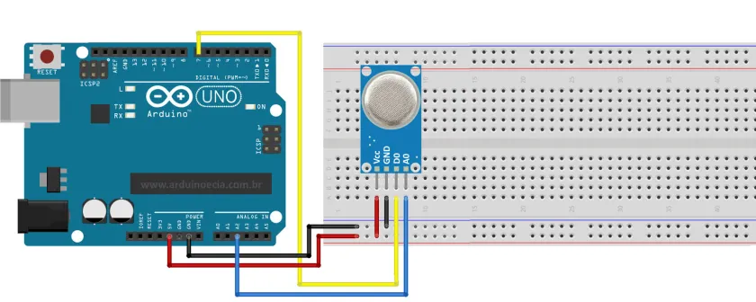

# MQ-135 Sensor de gases corrosivos
### Introdução
Este sensor é capaz de ler a presença de gases corrosivos (amônia, dióxido de carbono, benzeno, óxido nítrico, fumaça ou álcool, etc).
### Montagem
Há diferentes variantes deste mesmo sensor, por isso deve-se tomar cuidado com a pinagem. Neste caso foi utilizado a versão de 4 pinos soldada em uma placa: 

|Pino|Função|
|-|-|
|A0|Dado analógico|
|D0|Dado digital|
|GND|GND|
|VCC|VCC|
### Consumo de corrente e voltagem
Ele trabalha com uma voltagem na faixa de 3-5V, consumindo uma corrente de no máximo 150mA.
### Consumo de memória flash e SRAM no Arduino Uno
O Scketch padrão para teste do sensor fornecido pela bibliteca [<MQ135.h>](https://www.arduino.cc/reference/en/libraries/mq135/)  (também pode ser usada a biblioteca [<MQUnifiedsensor.h>](https://www.arduino.cc/reference/en/libraries/mqunifiedsensor/) no lugar) consumiu 6766 bytes de memória flash o que equivale a 20% da capacidade total, e 314 bytes da memória SRAM o que equivale a 15% capacidade total. Importante: no caso da biblioteca [<MQ135.h>](https://www.arduino.cc/reference/en/libraries/mq135/) é utilizada juntamente a biblioteca [<DHT.h>](https://www.arduino.cc/reference/en/libraries/dht-sensor-library/) para calibração das medições conforme a temperatura e umidade juntamente com o sensor (DHT11 ou DHT22).
### Bibliotecas utilizadas
Para funcionamento do sensor, será necessária instalação da biblioteca [<DHT.h>](https://www.arduino.cc/reference/en/libraries/dht-sensor-library/) e [<MQ135.h>](https://www.arduino.cc/reference/en/libraries/mq135/) na Arduino IDE. O Scketch a seguir é um exemplo de como utilizá-la, este que é fornecido pela própria biblioteca na seção de exemplos:
```
#include <MQ135.h>
#include <DHT.h>

/* MQ135 + DHT Temp Sensor

   Combination of the MQ135 air quality sensor and a DHT11/22 temperature sensor to accurately measure ppm values through the library correction.
   Uses the Adafruit DHT Sensor Library: https://github.com/adafruit/DHT-sensor-library

   Written by: https://github.com/Phoenix1747/MQ135
*/

#define PIN_MQ135 A2 // MQ135 Analog Input Pin
#define DHTPIN 2 // DHT Digital Input Pin
#define DHTTYPE DHT11 // DHT11 or DHT22, depends on your sensor

MQ135 mq135_sensor(PIN_MQ135);
DHT dht(DHTPIN, DHTTYPE);

float temperature, humidity; // Temp and Humid floats, will be measured by the DHT

void setup() {
  Serial.begin(9600);

  dht.begin();
}

void loop() {
  humidity = dht.readHumidity();
  temperature = dht.readTemperature();

  // Check if any reads failed and exit early (to try again).
  if (isnan(humidity) || isnan(temperature)) {
    Serial.println(F("Failed to read from DHT sensor!"));
    return;
  }

  float rzero = mq135_sensor.getRZero();
  float correctedRZero = mq135_sensor.getCorrectedRZero(temperature, humidity);
  float resistance = mq135_sensor.getResistance();
  float ppm = mq135_sensor.getPPM();
  float correctedPPM = mq135_sensor.getCorrectedPPM(temperature, humidity);

  Serial.print("MQ135 RZero: ");
  Serial.print(rzero);
  Serial.print("\t Corrected RZero: ");
  Serial.print(correctedRZero);
  Serial.print("\t Resistance: ");
  Serial.print(resistance);
  Serial.print("\t PPM: ");
  Serial.print(ppm);
  Serial.print("ppm");
  Serial.print("\t Corrected PPM: ");
  Serial.print(correctedPPM);
  Serial.println("ppm");

  delay(300);
}
```
> Busque por "[MQ-135 datasheet](https://www.google.com/search?q=MQ-135+datasheet)" para mais informações sobre este componente.
