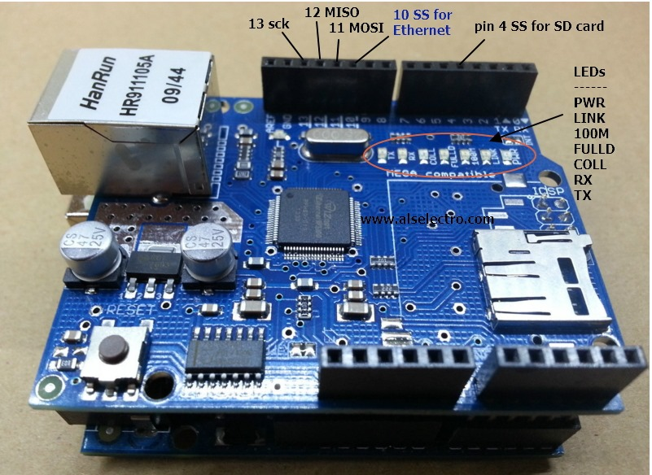

# Shield Ethernet W5100
### Introdução
Esta placa fornece ao arduino a capacidade de conectar-se e realizar ações na rede.
### Montagem
Basta encaixar os pinos corretamente ao arduino conforme a imagem.

É importante salientar que os pinos citados na tabela estarão reservados e não poderão ser utilizados.
|Pino|Função|
|-|-|
|13|Internet Shield SPI|
|12|Internet Shield SPI|
|11|Internet Shield SPI|
|10|Internet Shield controle|
|4|Cartão SD|
> Se somente o Ethernet for utilizado, o pino 4 está livre, da mesma forma se somente o SD for utilizado os pinos 13, 12, 11, 10 estarão livres.
### Consumo de corrente e voltagem
Trabalha conectado diretamente ao 5V do arduino, consumindo uma corrente de no máximo 183mA.
### Consumo de memória flash e SRAM no Arduino Uno
O Scketch utilizado no teste (exemplo abaixo) consumiu 20422 bytes de memória flash o equivalente a 63% da capacidade total e 1331 bytes de SRAM equivalendo a 64% da capacidade total.
### Bibliotecas utilizadas
Para funcionamento do Ethernet, será necessária instalação da biblioteca [<Ethernet.h>](https://www.arduino.cc/en/Reference/Ethernet) e [<SPI.h>](https://www.arduino.cc/en/reference/SPI)  na Arduino IDE, já para uso do SD também será necessária a biblioteca [<SD.h>](https://www.arduino.cc/en/reference/SD). Todas as bibliotecas citadas ou já são instaladas por *default* na Arduino IDE, ou estarão disponíveis na seção de instalação de bibliotecas da própria IDE. O Scketch a seguir é um exemplo de como utilizá-la, lendo um HTML do SD e enviando para o cliente após este ter requisitado:
```
#include <SPI.h>
#include <Ethernet.h>
#include <SD.h>

byte mac[] = { 0xDE, 0xAD, 0xBE, 0xEF, 0xFE, 0xED };
IPAddress ip(192, 168, 100, 40);  // Endereço IP que a Ethernet Shield terá. Deve ser alterado para um endereço livre da sua rede./
EthernetServer server(80);      // Cria um servidor WEB na porta 80

File webFile;

void setup()
{
    Ethernet.begin(mac, ip);  // Inicializa a Ethernet Shield, para DHCP omita o dado IP, como os outros dados possíveis que já estão omitidos nessa chamada
    server.begin();           // Inicia esperando por requisições dos clientes (Browsers)
    Serial.begin(9600);       // Inicia a comunicação Serial
    
    // inicia o leitor de cartão SD
    Serial.println("Iniciando o cartao SD...");
    if (!SD.begin(4)) {
        Serial.println("ERRO - a inicializacao do cartao SD falhou!");
        return;    //aborta a função SETUP caso exista erro
    }
    
    Serial.println("Cartao iniciado com SUCESSO!!");
    // verifica a existencia do arquivo 1~1.htm no cartao SD
    if (!SD.exists("1~1.htm")) {
        Serial.println("ERRO - O arquivo 1~1.htm nao foi localizado!");
        return;   //aborta a função SETUP caso exista erro
    }
    
    Serial.println("Arquivo 1~1.htm encontrado!");
}


void loop()
{
    EthernetClient client = server.available();  // Tenta pegar uma conexão com o cliente (Browser)

    if (client) {  // Existe um cliente em conexão ?
      
        boolean currentLineIsBlank = true;
        while (client.connected()) {
            if (client.available()) {   // os dados do cliente estão disponiveis para serem lidos
                char c = client.read(); // lê 1 byte (character) do cliente
                
                // a ultima linha da requisição do cliente é branca e termina com o caractere \n
                // responde para o cliente apenas após a última linha recebida
                if (c == '\n' && currentLineIsBlank) {
                  
                    // envia o cabeçalho de uma resposta http padrão
                    client.println("HTTP/1.1 200 OK");
                    client.println("Content-Type: text/html");
                    client.println("Connection: close");
                    client.println();

                    // ENVIA A PÁGINA WEB
                    webFile = SD.open("1~1.htm");        // abre o arquivo da pagina WEB
                    if (webFile) {
                        while(webFile.available()) {
                            client.write(webFile.read());  // envia a pagina WEB para o cliente (browser)
                        }
                        webFile.close();
                    }
                    break;
                }
                
                // toda linha de texto recebida do cliente termina com os caracteres \r\n
                if (c == '\n') {
                    // ultimo caractere da linha do texto recebido
                    // iniciando nova linha com o novo caractere lido
                    currentLineIsBlank = true;
                } 
                else if (c != '\r') {
                    // um caractere de texto foi recebido do cliente
                    currentLineIsBlank = false;
                }
            } // fim do if (client.available())
        } // fim do while (client.connected())
        
        delay(1);      // da um tempo para o WEB Browser receber o texto
        client.stop(); // termina a conexão

    } // fim do if (client)
} // fim do loop
```
> Busque por "[Ethernet Shield W5100 datasheet](https://www.google.com/search?q=Ethernet+Shield+W5100+datasheet)" para mais informações sobre este componente.
