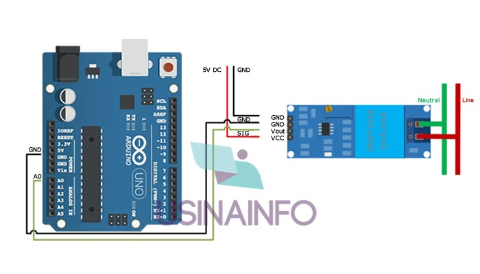

# ZMPT101B Voltímetro AC
### Introdução
Este sensor é capaz de ler a voltagem numa faixa 0-250V de corrente alternada. 
### Montagem
Se desejar, faça a [calibração](https://blogmasterwalkershop.com.br/arduino/como-usar-com-arduino-sensor-de-tensao-ac-0-a-250v-voltimetro-zmpt101b) deste sensor em um osciloscópio.

|Pino|Função|
|-|-|
|VCC|VCC|
|OUT|Dado|
|GND|GND|
|GND|GND|
### Consumo de corrente e voltagem
Ele trabalha com uma voltagem na faixa de 5-30V, consumindo uma corrente de no máximo 2mA.
### Consumo de memória flash e SRAM no Arduino Uno
O Scketch usado para teste é uma variação do exemplo padrão fornecido pela biblioteca [<EmonLib.h>](https://github.com/openenergymonitor/EmonLib) configurado para a voltagem AC de tomada em 220V.
### Bibliotecas utilizadas
Para funcionamento do sensor, será necessária instalação da biblioteca [<EmonLib.h>](https://github.com/openenergymonitor/EmonLib) na Arduino IDE. O Scketch a seguir é um exemplo de como utilizá-la:
```
#include "EmonLib.h" //INCLUSÃO DE BIBLIOTECA

#define VOLT_CAL 440.7 //VALOR DE CALIBRAÇÃO (DEVE SER AJUSTADO EM PARALELO COM UM MULTÍMETRO)
#define ZMPT101BPIN A0
EnergyMonitor emon1; //CRIA UMA INSTÂNCIA

void setup(){  
  Serial.begin(9600); //INICIALIZA A SERIAL
  emon1.voltage(ZMPT101BPIN, VOLT_CAL, 1.7); //PASSA PARA A FUNÇÃO OS PARÂMETROS (PINO ANALÓGIO / VALOR DE CALIBRAÇÃO / MUDANÇA DE FASE)
  emon1.current(1, 111.1);       // Current: input pin, calibration.
}

void loop(){
  emon1.calcVI(17,2000); //FUNÇÃO DE CÁLCULO (17 SEMICICLOS, TEMPO LIMITE PARA FAZER A MEDIÇÃO)    
  emon1.serialprint();           // Print out all variables (realpower, apparent power, Vrms, Irms, power factor)
  
  float realPower       = emon1.realPower;        //extract Real Power into variable
  float apparentPower   = emon1.apparentPower;    //extract Apparent Power into variable
  float powerFActor     = emon1.powerFactor;      //extract Power Factor into Variable
  float supplyVoltage   = emon1.Vrms;             //extract Vrms into Variable (Voltagem)
  float Irms            = emon1.Irms;             //extract Irms into VariableSERIAL (Corente)
  
  delay(1000);
}
```
> Busque por "[dht11 datasheet](https://www.google.com/search?q=dht11+datasheet)" para mais informações sobre este componente.

> Leia o [artigo sigerido](https://blogmasterwalkershop.com.br/arduino/como-usar-com-arduino-sensor-de-tensao-ac-0-a-250v-voltimetro-zmpt101b) para saber como realizar calibração usando um osciloscópio para obter maior precisão nas medições de corrente alternada AC.
