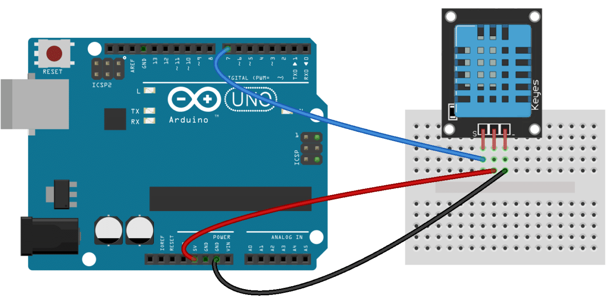

# DHT11 Sensor de umidade e temperatura
### Introdução
Este sensor é capaz de ler a temperatura do ambiente em F° ou C° com uma precisão de +/-2°C(temperatura) e +/-5%(umidade relativa do ar). Consegue ler parâmetros de umidade entre 20-90%(umidade relativa do ar) e temperatura entre 0-50°C.
### Montagem
Há diferentes variantes deste mesmo sensor, por isso deve-se tomar cuidado com a pinagem. Neste caso foi utilizado a versão de 3 pinos soldada em uma placa: 

|Pino|Função|
|-|-|
|S|Dado|
|Nada informado|VCC|
|\-|GND|
### Consumo de corrente e voltagem
Ele trabalha com uma voltagem na faixa de 3-5.5V, consumindo uma corrente de no máximo 2.5mA.
### Consumo de memória flash e SRAM no Arduino Uno
O Scketch padrão para teste do sensor fornecido pela bibliteca [<DHT.h>](https://www.arduino.cc/reference/en/libraries/dht-sensor-library/) consome 6728 bytes da memória flash, equivalente a 20% da capacidade total. Variáveis no Scketch consomem 219 bytes de memória SRAM, equivalente a 10% da capacidade total.
### Bibliotecas utilizadas
Para funcionamento do sensor, será necessária instalação da biblioteca [<DHT.h>](https://www.arduino.cc/reference/en/libraries/dht-sensor-library/) na Arduino IDE. O Scketch a seguir é um exemplo de como utilizá-la, este que é fornecido pela própria biblioteca na seção de exemplos:
```
// Example testing sketch for various DHT humidity/temperature sensors
// Written by ladyada, public domain

// REQUIRES the following Arduino libraries:
// - DHT Sensor Library: https://github.com/adafruit/DHT-sensor-library
// - Adafruit Unified Sensor Lib: https://github.com/adafruit/Adafruit_Sensor

#include "DHT.h"

#define DHTPIN 2     // Digital pin connected to the DHT sensor
// Feather HUZZAH ESP8266 note: use pins 3, 4, 5, 12, 13 or 14 --
// Pin 15 can work but DHT must be disconnected during program upload.

// Uncomment whatever type you're using!
#define DHTTYPE DHT11   // DHT 11
//#define DHTTYPE DHT22   // DHT 22  (AM2302), AM2321
//#define DHTTYPE DHT21   // DHT 21 (AM2301)

// Connect pin 1 (on the left) of the sensor to +5V
// NOTE: If using a board with 3.3V logic like an Arduino Due connect pin 1
// to 3.3V instead of 5V!
// Connect pin 2 of the sensor to whatever your DHTPIN is
// Connect pin 3 (on the right) of the sensor to GROUND (if your sensor has 3 pins)
// Connect pin 4 (on the right) of the sensor to GROUND and leave the pin 3 EMPTY (if your sensor has 4 pins)
// Connect a 10K resistor from pin 2 (data) to pin 1 (power) of the sensor

// Initialize DHT sensor.
// Note that older versions of this library took an optional third parameter to
// tweak the timings for faster processors.  This parameter is no longer needed
// as the current DHT reading algorithm adjusts itself to work on faster procs.
DHT dht(DHTPIN, DHTTYPE);

void setup() {
  Serial.begin(9600);
  Serial.println(F("DHTxx test!"));

  dht.begin();
}

void loop() {
  // Wait a few seconds between measurements.
  delay(2000);

  // Reading temperature or humidity takes about 250 milliseconds!
  // Sensor readings may also be up to 2 seconds 'old' (its a very slow sensor)
  float h = dht.readHumidity();
  // Read temperature as Celsius (the default)
  float t = dht.readTemperature();
  // Read temperature as Fahrenheit (isFahrenheit = true)
  float f = dht.readTemperature(true);

  // Check if any reads failed and exit early (to try again).
  if (isnan(h) || isnan(t) || isnan(f)) {
    Serial.println(F("Failed to read from DHT sensor!"));
    return;
  }

  // Compute heat index in Fahrenheit (the default)
  float hif = dht.computeHeatIndex(f, h);
  // Compute heat index in Celsius (isFahreheit = false)
  float hic = dht.computeHeatIndex(t, h, false);

  Serial.print(F("Humidity: "));
  Serial.print(h);
  Serial.print(F("%  Temperature: "));
  Serial.print(t);
  Serial.print(F("°C "));
  Serial.print(f);
  Serial.print(F("°F  Heat index: "));
  Serial.print(hic);
  Serial.print(F("°C "));
  Serial.print(hif);
  Serial.println(F("°F"));
}
```
