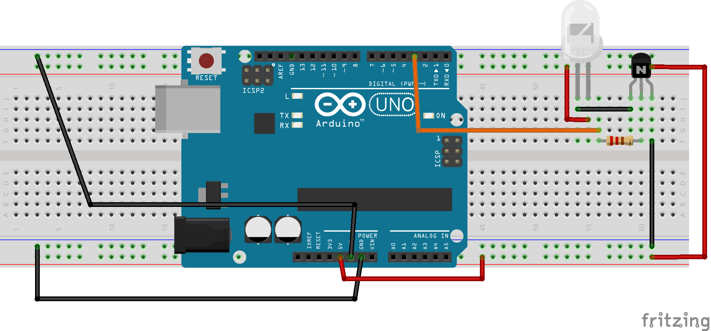

# IRreceiver Como ler o controle remoto
### Introdução
O emissor de infravermelho é um simples led, o qual emite luz na faixa invisível ao olho humano do infravermelho. 
### Montagem
Utilize o transistor 2N2222 juntamente com o resistor 470Ω.
 

### Consumo de corrente e voltagem
O led consome trabalha entre 1.4-1.6v consumindo no máximo 100mA. Já o transistor varia conforme a tensão fornecida e a corrente solicitada na hora do uso.
### Consumo de memória flash e SRAM no Arduino Uno
O Scketch usado para ler o infravermelho usa 6048 bytes de memória flash equivalendo a 18% da capacidade total, e 1678 bytes de SRAM equivalendo a 81% da capacidade total.
### Bibliotecas utilizadas
Instale todas as bibliotecas citadas na Arduino IDE para que não falte nada na hora que precise instanciá-las (menos a DHT), encontradas [aqui](https://github.com/akarsh98/Automatic-AC-Control-using-Arduino/tree/master/Libraries). Para conseguir instalar, será necessário zipar (doc.zip) cada uma das pastas, para que aí, zip por zip, seja possível instalá-las. A seguir o código exemplo de emissão de IR:
```
/* rawSend.ino Example sketch for IRLib2
 *  Illustrates how to send a code Using raw timings which were captured
 *  from the "rawRecv.ino" sample sketch.  Load that sketch and
 *  capture the values. They will print in the serial monitor. Then you
 *  cut and paste that output into the appropriate section below.
 */
#include <IRLibSendBase.h>    //We need the base code
#include <IRLib_HashRaw.h>    //Only use raw sender
#include <DHT.h>

#define DHTPIN A0 // Analog Pin sensor is connected to
#define DHTTYPE DHT11   // DHT 11
 
DHT dht(DHTPIN, DHTTYPE);

IRsendRaw mySender;

void setup() {
  Serial.begin(9600);
  delay(2000);
  dht.begin();
  while (!Serial); //delay for Leonardo
  Serial.println("DHT11 Humidity & temperature Sensor\n\n");
}
/* Cut and paste the output from "rawRecv.ino" below here. It will 
 * consist of a #define RAW_DATA_LEN statement and an array definition
 * beginning with "uint16_t rawData[RAW_DATA_LEN]= {…" and concludes
 * with "…,1000};"
 */
#define RAW_DATA_LEN 350
uint16_t rawDataOff[RAW_DATA_LEN]={
  526, 17806, 2978, 8922, 466, 530, 462, 1514, 
  518, 474, 518, 470, 490, 502, 490, 498, 
  490, 498, 494, 498, 514, 474, 518, 1458, 
  522, 498, 466, 522, 434, 1546, 430, 1550, 
  486, 502, 514, 1466, 518, 1462, 514, 1462, 
  518, 1462, 518, 1462, 518, 474, 518, 470, 
  518, 470, 518, 474, 518, 498, 490, 498, 
  434, 554, 434, 558, 486, 502, 514, 474, 
  518, 474, 518, 470, 518, 474, 514, 474, 
  518, 470, 518, 474, 514, 474, 518, 474, 
  518, 470, 518, 474, 514, 474, 518, 474, 
  514, 498, 466, 526, 430, 558, 482, 506, 
  486, 506, 486, 502, 490, 502, 490, 498, 
  490, 498, 490, 502, 490, 498, 466, 526, 
  462, 1514, 522, 1458, 438, 3038, 2982, 8886, 
  470, 1542, 438, 554, 406, 582, 410, 578, 
  410, 582, 430, 558, 462, 530, 462, 526, 
  462, 526, 466, 1514, 466, 522, 466, 526, 
  462, 1518, 462, 526, 462, 1514, 466, 1542, 
  438, 1542, 410, 1570, 406, 1570, 462, 1518, 
  466, 526, 462, 526, 462, 526, 466, 526, 
  462, 526, 466, 526, 462, 526, 462, 526, 
  466, 526, 462, 526, 466, 550, 438, 554, 
  406, 582, 410, 582, 406, 582, 430, 558, 
  462, 530, 462, 526, 462, 526, 466, 526, 
  462, 526, 466, 526, 462, 526, 462, 526, 
  466, 526, 462, 526, 466, 526, 462, 526, 
  462, 554, 438, 550, 410, 582, 406, 582, 
  410, 582, 430, 558, 458, 530, 462, 530, 
  462, 3010, 2986, 8886, 470, 1514, 466, 522, 
  466, 526, 462, 526, 466, 526, 462, 526, 
  462, 530, 462, 526, 462, 554, 406, 1570, 
  410, 582, 410, 578, 434, 1546, 466, 1514, 
  462, 1514, 466, 1514, 466, 526, 462, 1514, 
  466, 1514, 466, 1510, 470, 1538, 438, 1542, 
  410, 1570, 430, 1546, 462, 1518, 466, 526, 
  462, 526, 466, 526, 462, 1514, 466, 1514, 
  466, 1514, 462, 526, 466, 554, 434, 554, 
  434, 554, 410, 582, 406, 1570, 434, 558, 
  458, 530, 462, 1518, 462, 1514, 466, 526, 
  462, 526, 466, 526, 462, 1514, 466, 526, 
  462, 526, 466, 526, 462, 554, 438, 550, 
  434, 558, 406, 582, 410, 578, 410, 582, 
  458, 1518, 466, 1514, 466, 1000};

#define RAW_DATA_LEN 350
uint16_t rawDataOn[RAW_DATA_LEN]={
  526, 17802, 2930, 8974, 438, 554, 438, 1538, 
  438, 554, 438, 554, 434, 554, 434, 554, 
  438, 554, 434, 554, 438, 554, 434, 1538, 
  442, 554, 434, 582, 510, 1466, 518, 474, 
  490, 498, 434, 1546, 434, 1542, 438, 1542, 
  438, 1542, 438, 1542, 434, 558, 434, 554, 
  434, 558, 434, 554, 434, 582, 406, 582, 
  506, 482, 514, 478, 490, 498, 466, 526, 
  434, 554, 434, 554, 438, 554, 434, 554, 
  438, 554, 434, 554, 434, 558, 434, 554, 
  434, 554, 438, 554, 434, 554, 434, 558, 
  434, 558, 430, 582, 410, 578, 494, 498, 
  514, 474, 466, 522, 434, 558, 434, 554, 
  438, 554, 434, 554, 434, 1542, 438, 1542, 
  438, 1542, 438, 1542, 542, 2930, 3002, 8842, 
  470, 1570, 510, 478, 502, 490, 490, 498, 
  466, 526, 434, 554, 434, 554, 438, 554, 
  434, 554, 438, 1538, 438, 554, 438, 554, 
  434, 1542, 438, 554, 434, 1538, 442, 1570, 
  410, 1566, 514, 1466, 466, 1514, 434, 1546, 
  434, 554, 438, 554, 434, 554, 438, 550, 
  438, 554, 434, 554, 438, 554, 434, 554, 
  438, 554, 434, 558, 430, 582, 410, 578, 
  510, 482, 502, 486, 490, 498, 434, 558, 
  434, 554, 438, 554, 434, 554, 438, 554, 
  434, 554, 434, 554, 438, 554, 434, 554, 
  438, 554, 434, 554, 434, 558, 434, 554, 
  434, 582, 410, 578, 514, 478, 490, 498, 
  490, 498, 434, 558, 434, 554, 438, 554, 
  434, 3038, 2898, 8974, 442, 1538, 438, 554, 
  438, 554, 434, 554, 434, 558, 434, 554, 
  434, 558, 434, 578, 410, 582, 506, 1470, 
  494, 498, 466, 522, 434, 1546, 434, 554, 
  438, 1542, 438, 1542, 434, 554, 438, 1542, 
  434, 1542, 438, 1542, 438, 1570, 410, 1566, 
  514, 1466, 490, 1490, 434, 1542, 438, 554, 
  438, 554, 434, 554, 438, 1538, 438, 1542, 
  438, 1542, 438, 554, 434, 558, 434, 578, 
  410, 582, 510, 478, 506, 1470, 494, 498, 
  434, 554, 438, 1542, 438, 1542, 434, 554, 
  438, 554, 434, 554, 438, 1542, 434, 554, 
  438, 554, 434, 554, 438, 578, 410, 582, 
  406, 582, 490, 498, 514, 1466, 434, 1542, 
  438, 1542, 438, 1542, 438, 1000};


/*
 * Cut-and-paste into the area above.
 */
   
void loop() {
  int temp = dht.readTemperature();
  Serial.print("temperature = ");
  Serial.print(temp); 
  Serial.println(" C");
  if (temp > 29) {
    mySender.send(rawDataOn,RAW_DATA_LEN,36);//Pass the buffer,length, optionally frequency
    Serial.println(F("AC Switched On"));
  }
  else if (temp < 26) {
    mySender.send(rawDataOff,RAW_DATA_LEN,36);//Pass the buffer,length, optionally frequency
    Serial.println(F("AC Switched Off"));
  }
  delay(5000);
}
```
