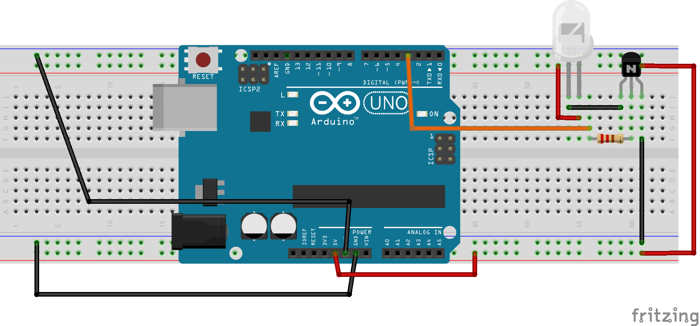

# IRsender Como emitir o infravermelho usando PROGMEM
### Introdução
O emissor de infravermelho é um simples led, o qual emite luz na faixa invisível ao olho humano do infravermelho. Sabemos que a SRAM do Arduino é limitada, e gravar vetores enormes com marcas de tempo RAW pode consumir toda a memória causando travamento completo no funcionamento do Arduino, para contornar isso, em vez de gravar os dados RAW em SRAM, podemos alocá-los no armazenamento Flash do Arduino que é muito maior. Mas atente-se: Dados em Flash são exclusivamente estáticos, dados que requerem ser dinâmicos(modificados em tempo de execução) devem obrigatoriamente estar na SRAM. Até o momento, a biblioteca IRLib2 não possui suporte para o envio de RAW diretamente em Flash, mas contornamos isso utilizando recursos da versão 2.0.1 da [IRremote](https://www.arduino.cc/reference/en/libraries/irremote/) (à partir da versão 3.x a forma de programação muda bastante e não está tão bem documentada ainda, além de na época do desenvolvimento estar apresentando bugs), não precisando de uma versão mais atual para nossa aplicação. O [artigo](https://www.analysir.com/blog/2016/04/11/sending-long-ac-signals-flash-irremote/) explica como o processo de envio do RAW foi feito.
### Montagem
Utilize o transistor 2N2222 juntamente com o resistor 470Ω.
 

### Consumo de corrente e voltagem
O led consome trabalha entre 1.4-1.6v consumindo no máximo 100mA. Já o transistor varia conforme a tensão fornecida e a corrente solicitada na hora do uso.
### Consumo de memória flash e SRAM no Arduino Uno
O sketch usa 2852 bytes (8%) de espaço de armazenamento para programas. O máximo são 32256 bytes.
Variáveis globais usam 219 bytes (10%) de memória dinâmica, deixando 1829 bytes para variáveis locais. O máximo são 2048 bytes.
### Bibliotecas utilizadas
Foi utilizada a [IRremote 2.0.1](https://www.arduino.cc/reference/en/libraries/irremote/).  A seguir o código exemplo de emissão de IR:
```
#include <IRremote.h> //IRremote 2.0.1

IRsend irsend;

const PROGMEM short rawDataOff[]={
  5994, 7398, 506, 1662, 478, 1710, 498, 1690, 
  458, 1706, 506, 1686, 538, 1630, 462, 1722, 
  546, 1626, 546, 610, 518, 586, 498, 638, 
  518, 586, 498, 634, 522, 586, 498, 634, 
  522, 586, 498, 1666, 546, 1642, 546, 1622, 
  442, 1742, 546, 1646, 526, 1634, 550, 1642, 
  546, 1622, 514, 642, 518, 590, 494, 638, 
  518, 586, 494, 642, 518, 586, 498, 634, 
  522, 586, 498, 1662, 546, 1646, 542, 1626, 
  482, 1702, 538, 1650, 534, 1630, 542, 1646, 
  538, 1650, 462, 674, 510, 598, 490, 642, 
  510, 594, 530, 602, 514, 594, 534, 598, 
  514, 618, 514, 1626, 442, 1742, 542, 594, 
  486, 1674, 546, 1642, 546, 590, 494, 1666, 
  498, 1690, 494, 614, 502, 630, 494, 1674, 
  466, 682, 478, 630, 446, 1734, 490, 626, 
  442, 682, 486, 630, 466, 1714, 462, 670, 
  482, 1686, 394, 1790, 486, 626, 446, 1738, 
  454, 1730, 486, 1686, 414, 714, 482, 1702, 
  486, 626, 478, 650, 482, 1690, 414, 710, 
  482, 630, 394, 730, 486, 1702, 486, 622, 
  482, 1706, 486, 626, 394, 1786, 486, 630, 
  466, 658, 486, 1702, 482, 630, 450, 1734, 
  482, 634, 462, 1718, 450, 678, 486, 1686, 
  446, 1734, 486, 7422, 482, 1000};

const PROGMEM short rawDataOn[]={
  5998, 7474, 466, 1718, 470, 1730, 454, 1746, 
  466, 1766, 394, 1770, 466, 1726, 434, 1774, 
  466, 1718, 470, 670, 446, 702, 446, 670, 
  398, 746, 470, 646, 482, 666, 446, 670, 
  470, 646, 442, 1750, 494, 1710, 422, 1770, 
  494, 1698, 414, 1790, 498, 1694, 470, 1734, 
  498, 1690, 542, 622, 478, 642, 478, 638, 
  498, 646, 506, 614, 434, 710, 506, 610, 
  486, 658, 486, 1678, 538, 1670, 506, 1678, 
  478, 1754, 478, 1706, 482, 1726, 454, 1734, 
  482, 1706, 474, 666, 482, 642, 442, 694, 
  482, 638, 446, 694, 454, 666, 450, 694, 
  450, 666, 450, 1762, 454, 662, 478, 642, 
  470, 1738, 450, 1762, 446, 670, 450, 1738, 
  446, 1762, 450, 670, 446, 1762, 450, 1738, 
  442, 698, 450, 670, 446, 1762, 446, 674, 
  446, 694, 450, 670, 446, 1762, 446, 674, 
  446, 1762, 446, 1738, 446, 698, 442, 1742, 
  446, 1742, 466, 1742, 442, 678, 462, 1746, 
  442, 678, 438, 702, 442, 1746, 438, 706, 
  438, 682, 434, 730, 414, 1746, 438, 730, 
  414, 1746, 438, 730, 410, 1750, 434, 734, 
  410, 706, 414, 1794, 414, 706, 414, 1794, 
  414, 706, 414, 1770, 438, 706, 414, 1770, 
  414, 1794, 414, 7550, 414, 1000};

const PROGMEM short rawDataDehumidify[]={
  6062, 7422, 458, 1750, 510, 1678, 506, 1702, 
  506, 1678, 478, 1730, 506, 1682, 474, 1730, 
  510, 1682, 414, 722, 506, 614, 446, 690, 
  510, 614, 474, 662, 510, 610, 510, 630, 
  510, 610, 510, 1698, 506, 1682, 534, 1670, 
  506, 1682, 442, 1758, 514, 1682, 446, 1754, 
  510, 1698, 474, 642, 510, 634, 470, 646, 
  510, 614, 462, 674, 510, 614, 414, 718, 
  510, 638, 394, 1782, 510, 1702, 470, 1714, 
  506, 1702, 506, 1678, 478, 1726, 510, 1682, 
  414, 1786, 510, 634, 442, 674, 510, 614, 
  490, 646, 506, 634, 398, 718, 510, 614, 
  490, 642, 510, 1702, 470, 646, 510, 1698, 
  474, 642, 510, 630, 478, 638, 510, 634, 
  474, 1710, 510, 630, 502, 1686, 498, 638, 
  506, 1682, 474, 1726, 482, 1726, 446, 1738, 
  482, 662, 446, 670, 482, 1726, 482, 1702, 
  454, 686, 506, 1678, 474, 1730, 514, 610, 
  470, 1730, 514, 1694, 478, 638, 518, 626, 
  474, 1710, 482, 658, 506, 610, 550, 1658, 
  510, 610, 450, 686, 510, 1678, 466, 670, 
  510, 1682, 462, 670, 510, 1698, 474, 642, 
  510, 634, 470, 1714, 502, 638, 506, 1678, 
  470, 670, 502, 1690, 462, 670, 502, 1706, 
  442, 1738, 502, 7478, 470, 1000};

#define khz 36

void sendRAW_Flash(const unsigned int * signalArray, unsigned int signalLength, unsigned char carrierFreq) {
  irsend.enableIROut(carrierFreq); //initialise the carrier frequency for each signal to be sent
  for (unsigned int i=0; i < signalLength; i++) {
    if (i & 1) irsend.space(pgm_read_word_near(&signalArray[i]));
    else irsend.mark(pgm_read_word_near(&signalArray[i]));
  }
  irsend.space(1);//make sure IR is turned off at end of signal
}

void setup() {

}

void loop() {
  sendRAW_Flash(rawDataOff, sizeof(rawDataOff)/sizeof(int),khz);
  delay(5000);
  sendRAW_Flash(rawDataOn, sizeof(rawDataOn)/sizeof(int),khz);
  delay(5000);
  sendRAW_Flash(rawDataDehumidify, sizeof(rawDataDehumidify)/sizeof(int),khz);
  delay(5000);
}
```
