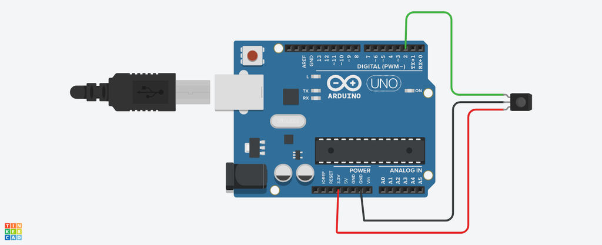
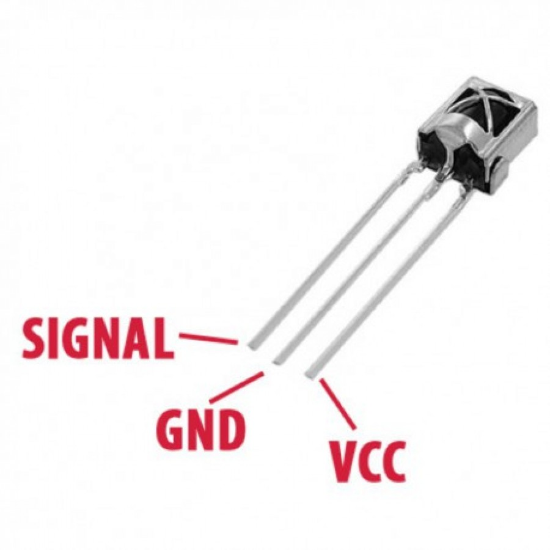
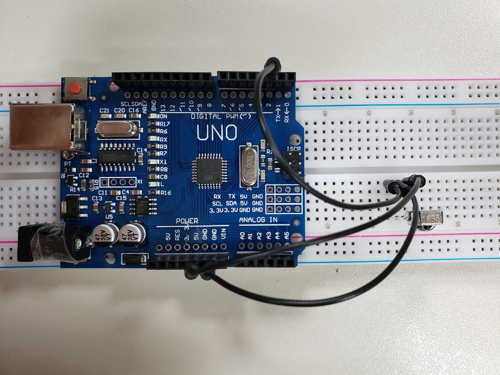

# IRreceiver Como ler o controle remoto
### Introdução
O leitor de infravermelho para o Arduino com 3 pinos é usado no projeto para clonar o controle remoto do Ar Condicionado. Após feitas corretamente as configurações no controle para o que se espera quando liga o ar condicionado, clone a Liga e o Desliga.
### Montagem
Neste caso foi usado a versão de 3 pinos, há também o de 2 pinos apenas:
  

### Consumo de corrente e voltagem
Ele trabalha com uma voltagem na faixa de 2.7-5.5V, consumindo uma corrente de no máximo 1.5mA.
### Consumo de memória flash e SRAM no Arduino Uno
O Scketch usado para ler o infravermelho usa 3760 bytes de memória flash equivalendo a 11% da capacidade total, e 1027 bytes de SRAM equivalendo a 50% da capacidade total.
### Bibliotecas utilizadas
Instale todas as bibliotecas citadas na Arduino IDE para que não falte nada na hora que precise instanciá-las (menos a DHT), encontradas [aqui](https://github.com/akarsh98/Automatic-AC-Control-using-Arduino/tree/master/Libraries). Para conseguir instalar, será necessário zipar (doc.zip) cada uma das pastas, para que aí, zip por zip, seja possível instalá-las. A seguir o código de leitura de IR:
```
/* rawR&cv.ino Example sketch for IRLib2
 *  Illustrate how to capture raw timing values for an unknow protocol.
 *  You will capture a signal using this sketch. It will output data the 
 *  serial monitor that you can cut and paste into the "rawSend.ino"
 *  sketch.
 */
// Recommend only use IRLibRecvPCI or IRLibRecvLoop for best results
#include <IRLibRecvPCI.h> 

IRrecvPCI myReceiver(2);//pin number for the receiver

void setup() {
  Serial.begin(9600);
  delay(2000); while (!Serial); //delay for Leonardo
  myReceiver.enableIRIn(); // Start the receiver
  Serial.println(F("Ready to receive IR signals"));
  myReceiver.setFrameTimeout(100000);
}

void loop() {
  //Continue looping until you get a complete signal received
  if (myReceiver.getResults()) { 
    Serial.println(F("Do a cut-and-paste of the following lines into the "));
    Serial.println(F("designated location in rawSend.ino"));
    Serial.print(F("\n#define RAW_DATA_LEN "));
    Serial.println(recvGlobal.recvLength,DEC);
    Serial.print(F("uint16_t rawData[RAW_DATA_LEN]={\n\t"));
    for(bufIndex_t i=1;i<recvGlobal.recvLength;i++) {
      Serial.print(recvGlobal.recvBuffer[i],DEC);
      Serial.print(F(", "));
      if( (i % 8)==0) Serial.print(F("\n\t"));
    }
    Serial.println(F("1000};"));//Add arbitrary trailing space
    myReceiver.enableIRIn();      //Restart receiver
  }
}
```
