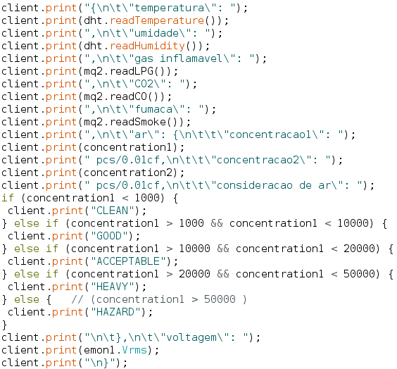
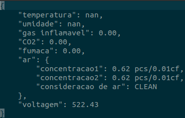
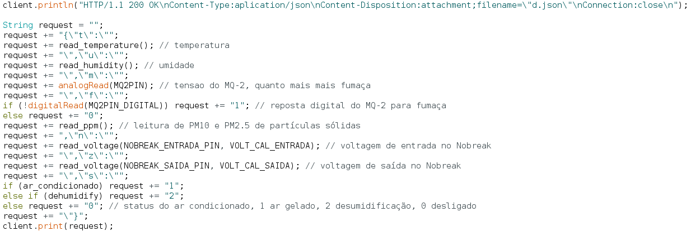

# JSON Como foi criado
### Introdução
O JSON emitido pela placa de rede foi constituído com base em prints, esses seguindo uma lógica para que o documento fique com a formatação esperada em um arquivo do tipo.
### Configuração de cabeçalho JSON
Para que o navegador interprete o texto recebido corretamente como JSON, é importante informá-lo sobre isso, para isso basta à partir do objeto ```EthernetClient client = server.available()``` usando ```client.print()``` printa 

```
client.println("HTTP/1.1 200 OK");
client.println("Content-Type: aplication/json");
client.println("Connection: close");
client.println();
```

### Construção do JSON
À partir do objeto ```EthernetClient client = server.available()``` é utilizado o ```client.print()``` ou ```client.println()``` para gerar o arquivo, sendo que a variação "ln" do print é acompanhada automaticamente do caractere "\n".
 <br>
"\n" 's são usados para quebra de linha, e "\t" 's são usados para distanciar o objeto da esquerda conforme necessário para que se obtenha a correta indentação, por exemplo:
```{\n\t\"temperatura\": "); client.print(dht.readTemperature();``` obtém 

```
{
	"temperatura": nan
```
mais
```client.print(",\n\t\"umidade\": "); client.print(dht.readHumidity());``` obtém
```
{
	"temperatura": nan,
	"umidade": nan
```

Tudo o que for texto sequencial pode ser printado em uma sequência única, como "\n", "\t", "\""(Para poder printar " obrigatoriamente deve vir acompanhada de \: "\"". Essa regra vale em qualquer linguagem de programação em que deseja-se mostrar um caractere reservado pela linguagem!), ":", "{" ou "}", "," e textos fixos. Já dados obtidos pelos sensores obrigatoriamente deve estar em um print independente. Importante: Já que o controle de "\n" está sendo feito manualmente, no caso da criação do JSON é melhor limitar-se ao ```client.print()``` e não utilizar a variação "ln" para melhor compreensão do resulta final.

### Contornando problemas de interpretação com o Zabbix
Em caso do Zabbix não saber interpretar ```\t```, ```\``` ou ```\n```(caracteres especiais),  podemos contornar este problema com uma abordagem de construção do arquivo JSON diferente:

Strings são concatenadas e só ao fim enviadas, perceba que não foi feito uso de nenhum caractere ```\t``` e ```\n``` na construção do JSON, só no cabeçalho. A redução da quantidade também proporciona um menor uso de SRAM.
