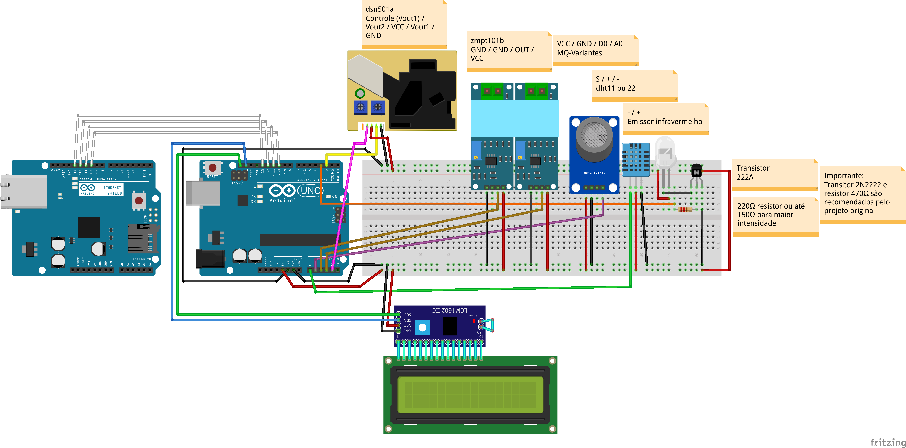

# Explicações sobre o projeto
### Introdução
Este projeto de monitoramento e controle do clima no ambiente, tem por objetivo economizar energia com base em limites aceitáveis de temperatura e umidade no ambiente do datacenter da UFFS, e também detectar substâncias estranhas no ar que possam indicar contaminantes provenientes de incêndio ou n]ao: Gases tóxicos e/ou corrosivos, fuligem ou CO².
### Hardware
Para montagem deste projeto seja em protoboard, seja soldado, siga o passo-a-passo conectando os cabinhos exatamente como na imagem. Caso alguma configuração no código seja alterada, conexões devem obrigatoriamente serem revistas!
Placa Ethernet vai encaixada sob o Arduino Uno, as conexões são feitas no [Shield Ethernet](../Componentes/Shield Ethernet W5100)! Os cabos brancos representados são as conexões reservadas para que a placa funcione juntamente ao Arduino. Pino 4 não está sendo usado pela placa para cartão SD.

### Software
* O primeiro passo será [ler o controle](../Infravermelho/Leitura) se o modelo de ar condicionado for outro a não ser o Komecco já instanciado nos códigos desse projeto.
* O segundo passo será inserir a string "rawDataOff" no código fonte deste projeto.
* O terceiro passo será rodar o código fonte fornecido a seguir, após ter inserido a string "rawDataOn" e ter [medido seu tamanho](https://www.charactercountonline.com/pt/) para que possa informar à função de escrita na EEPROM. Copie somente do primeiro ao último número separados por , !
```
#include <EEPROM.h>

void writeIntArrayIntoEEPROM(int address, int numbers[], int arraySize)
{
  int addressIndex = address;
  for (int i = 0; i < arraySize; i++) 
  {
    EEPROM.write(addressIndex, numbers[i] >> 8);
    EEPROM.write(addressIndex + 1, numbers[i] & 0xFF);
    addressIndex += 2;
  }
}

void readIntArrayFromEEPROM(int address, int numbers[], int arraySize)
{
  int addressIndex = address;
  for (int i = 0; i < arraySize; i++)
  {
    numbers[i] = (EEPROM.read(addressIndex) << 8) + EEPROM.read(addressIndex + 1);
    addressIndex += 2;
  }
}

#define RAW_DATA_LEN 198
int rawDataOn[RAW_DATA_LEN] = {
  //on
  5998, 7474, 466, 1718, 470, 1730, 454, 1746, 
  466, 1766, 394, 1770, 466, 1726, 434, 1774, 
  466, 1718, 470, 670, 446, 702, 446, 670, 
  398, 746, 470, 646, 482, 666, 446, 670, 
  470, 646, 442, 1750, 494, 1710, 422, 1770, 
  494, 1698, 414, 1790, 498, 1694, 470, 1734, 
  498, 1690, 542, 622, 478, 642, 478, 638, 
  498, 646, 506, 614, 434, 710, 506, 610, 
  486, 658, 486, 1678, 538, 1670, 506, 1678, 
  478, 1754, 478, 1706, 482, 1726, 454, 1734, 
  482, 1706, 474, 666, 482, 642, 442, 694, 
  482, 638, 446, 694, 454, 666, 450, 694, 
  450, 666, 450, 1762, 454, 662, 478, 642, 
  470, 1738, 450, 1762, 446, 670, 450, 1738, 
  446, 1762, 450, 670, 446, 1762, 450, 1738, 
  442, 698, 450, 670, 446, 1762, 446, 674, 
  446, 694, 450, 670, 446, 1762, 446, 674, 
  446, 1762, 446, 1738, 446, 698, 442, 1742, 
  446, 1742, 466, 1742, 442, 678, 462, 1746, 
  442, 678, 438, 702, 442, 1746, 438, 706, 
  438, 682, 434, 730, 414, 1746, 438, 730, 
  414, 1746, 438, 730, 410, 1750, 434, 734, 
  410, 706, 414, 1794, 414, 706, 414, 1794, 
  414, 706, 414, 1770, 438, 706, 414, 1770, 
  414, 1794, 414, 7550, 414, 1000
};
  
int address = 0;
void setup () {
  Serial.begin(9600);
// Antes disso, zere todas as posições! A EEPROM não é volátil.
//  for (int i = 0; i < EEPROM.length(); i++) EEPROM.write(i, 0);
//  Serial.println("EEPROM zerada");
  writeIntArrayIntoEEPROM(0, rawDataOn, RAW_DATA_LEN);
}

void loop () {
  int novo[198];
  readIntArrayFromEEPROM(0, novo, RAW_DATA_LEN);

  for (int i = 0; i < RAW_DATA_LEN; i++) Serial.println(novo[i]);
  delay(999999999);
}
```
* O quinto passo é carregar o código definitivo no Arduino.
```
aaaaaaa
```
> Warnings podem ocorrer devido à conversão de int para uint16_t, mas isso não causa nenhum problema real.
